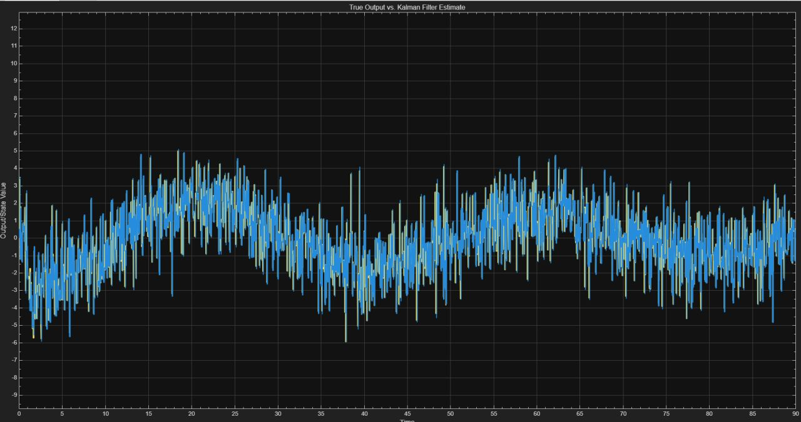
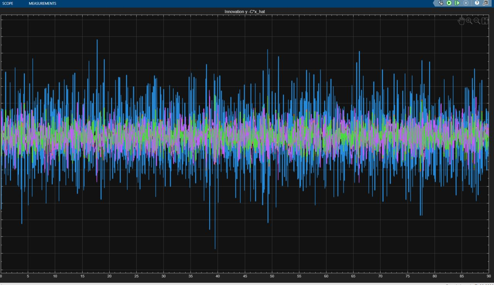
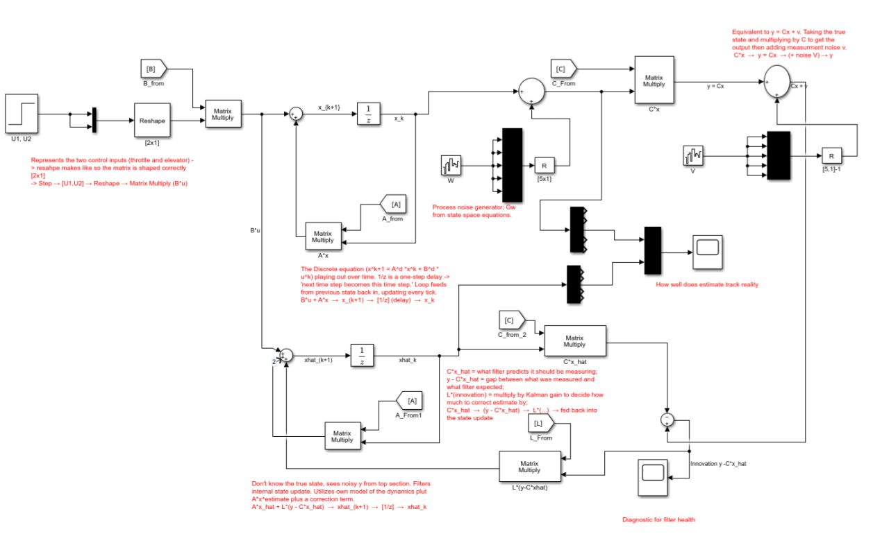

# MIMO Kalman Filter with PID Control (MATLAB/Simulink)

A multi-input, multi-output (MIMO) Kalman filter with PID control, built in MATLAB and Simulink. The plant is a 5-state longitudinal aircraft model in state-space form. The optimal steady-state Kalman gain is computed from the discrete Riccati equation, and the filter estimates all five states from noisy sensor measurements.

## Results

  

  

[1-2 sentences on what the plots show, e.g. "The filter tracks the true states despite measurement noise, and the estimation error stays small."]

## Simulink Model

  

[1-2 sentences on the blocks: plant, noise sources, Kalman filter, PID controller, and what the PID is controlling.]

## System Model

The continuous-time plant is a linearized longitudinal model with 5 states, 2 inputs, and 5 outputs (full-state measurement, so `C = I`).

| | Variables |
|---|---|
| **States** | `u` (forward velocity), `w` (vertical velocity), `q` (pitch rate), `θ` (pitch angle), `h` (altitude) |
| **Inputs** | `δ_t` (thrust), `δ_e` (elevator) |
| **Outputs** | All 5 states |

The open-loop system is marginally stable. It is discretized with a zero-order hold at a 0.05 s sample time (20 Hz):

$$x_{k+1} = A x_k + B u_k + G w_k$$
$$y_k = C x_k + D u_k + H w_k + v_k$$

where `w` is process noise and `v` is measurement noise. Here `G = I` (a disturbance on each of the 5 states) and `H = 0`.

**Noise covariances:** `Q = 0.95·I` (process) and `R = 0.95·I` (measurement). 

## Method

1. Define the continuous-time plant `(Ac, Bc, Cc, Dc)` and discretize it with `c2d` (zero-order hold, 0.05 s).
2. Augment the model with process disturbances `G` and `H`.
3. Compute the steady-state Kalman gain `L` and error covariance `P` with MATLAB's `kalman`, assuming process and measurement noise are uncorrelated.
4. Verify the result by recomputing the gain by hand from the Riccati solution: `L = A P Cᵀ (C P Cᵀ + R)⁻¹`, and confirming it matches MATLAB's `L`.
5. Check observer stability by confirming the eigenvalues of `A − L·C` lie inside the unit circle.
6. Use the filter in Simulink with noisy measurements.

## How to Run

1. Download or clone this repo and open the folder in MATLAB.
2. Run `MIMO_KALMAN_FILTER.m` to define the plant, discretize it, and compute the Kalman gain.
3. Open `MIMO_KALMAN_SIMULINK.slx` and click **Run**.

**Requirements:** MATLAB [version], Simulink, Control System Toolbox.

## Files

| File | Description |
|---|---|
| `MIMO_KALMAN_FILTER.m` | Defines the plant, discretizes it, and computes and verifies the Kalman gain |
| `MIMO_KALMAN_SIMULINK.slx` | Simulink model with the plant, Kalman filter, noise, and PID controller |
| `KALMAN_RESULTS.jpg`, `KALMAN_RESULTS(2).jpg` | Simulation results |
| `SIMULINK_MODEL_IMAGE.jpg` | Block diagram screenshot |

## Future Work

- Extend to an Extended Kalman Filter (EKF) for nonlinear dynamics
- Use only a subset of sensors (partial-state measurement) instead of measuring all five states
- Apply the approach to a 6DOF fixed-wing aircraft state estimator
